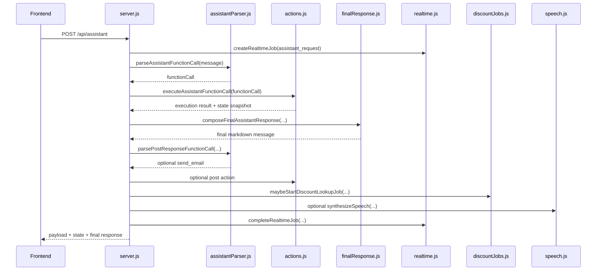

# 当前工作流说明

本文档按当前代码实现整理 Financial App AI Assistant MVP 的运行逻辑，帮助快速理解「用户输入如何变成内部动作、状态更新、最终回复和后台查询」。

## 1. 系统定位

这是一个本地运行的金融助手 MVP。核心目标是验证下面这条链路：

```text
语音或文本输入
  -> Gemini function calling 或本地 mock parser
  -> 内部 app function
  -> 更新内存状态或查询外部信息
  -> Gemini 最终回复合成
  -> 前端展示结果、地图、调试信息和可选语音回复
```

当前没有数据库。应用状态保存在 Node 进程内的 `appState` 中，重启服务后会回到种子数据。

## 2. 入口和模块

| 模块 | 作用 |
| --- | --- |
| `src/server.js` | Express 服务入口，注册 API、静态资源和 WebSocket。 |
| `public/app.js` | 浏览器端交互：提交指令、录音、渲染状态、渲染地图、接收实时任务事件。 |
| `src/assistantParser.js` | 把自然语言路由成一个注册函数调用。优先 Gemini function calling，失败或无 key 时走本地规则。 |
| `src/functionSchema.js` | 定义支持的函数、参数规范、参数归一化和校验。 |
| `src/actions.js` | 内部动作分发器。根据函数名执行记账、删除、概览、邮件、零售查询等逻辑。 |
| `src/appState.js` | 内存态 demo 数据、重置、快照、支出汇总。 |
| `src/finalResponse.js` | 根据工具结果合成最终面向用户的 Markdown 回复。 |
| `src/realtime.js` | WebSocket 客户端、任务、进度、取消、流式 token 事件。 |
| `src/speech.js` | Gemini 语音转写和 TTS。 |
| `src/discountJobs.js` | 记账或添加愿望清单后启动后台折扣/优惠查询。 |
| `src/retail/**` | 零售商品价格、库存、门店发现和 grounding fallback。 |
| `src/retailOffers/**` | 零售商本周优惠、Prospekt、官方优惠页和 grounding fallback。 |
| `src/localDeals/**` | 本地餐饮/商户折扣、优惠券、门店发现和 grounding fallback。 |
| `src/email.js` | Gmail SMTP 或 dry-run 邮件发送。 |

## 3. 前端工作流

前端页面在 `public/index.html`，主要逻辑在 `public/app.js`。

页面初始化时：

1. 请求 `GET /api/state`，渲染 demo profile、支出、愿望清单、邮件记录。
2. 连接 `ws://host/ws`，拿到 `clientId`。
3. 从 `localStorage` 读取输出语言，默认中文。

文本输入时：

```text
用户提交表单
  -> POST /api/assistant
  -> 带上 message、clientId、responseLanguage、speak
  -> 渲染 assistant answer
  -> 更新右侧 app state
  -> 如果返回 speech，则播放 WAV
```

语音输入时：

```text
点击 Start voice input
  -> 浏览器录音并编码成 WAV
  -> POST /api/transcribe
  -> Gemini 转写
  -> 如果不是英文，前端直接显示 rejected
  -> 如果转写成功，调用 /api/assistant，inputMode = voice
  -> voice 请求强制生成 TTS 回复
```

实时任务显示：

1. WebSocket 收到 `job_started` 后，在右侧 `Realtime Jobs` 显示任务。
2. 收到 `job_progress` 后更新阶段和地图点。
3. 收到 `llm_token` 后流式更新后台折扣总结卡片。
4. 用户点击 `Cancel` 会发送 `cancel_job`，后端通过 AbortController 取消任务。

## 4. 主请求后端工作流

`POST /api/assistant` 是主链路入口。



关键点：

1. 每次 assistant 请求都会尝试创建实时任务，但只有前端传入有效 `clientId` 时才会创建。
2. parser 必须返回一个注册函数调用。
3. `actions.js` 会再次规范化和校验函数调用，校验失败会返回 `reject_function_call`。
4. 工具执行完后，最终回复不是直接把工具消息返回给用户，而是交给 `finalResponse.js` 做用户可读的 Markdown 总结。
5. 如果原始请求包含「把最后结果发邮件给我」这类意图，主函数先处理查询/总结，最终回复生成后才执行 post-response `send_email`。
6. 如果需要语音，最后再调用 Gemini TTS。

## 5. Function Calling 路由逻辑

`assistantParser.js` 的优先路径：

```text
有 GEMINI_API_KEY
  -> Gemini function calling
  -> 返回 response.functionCalls[0]

没有 GEMINI_API_KEY 或 Gemini 失败
  -> 本地 mock parser
  -> 用正则和规则猜测函数
```

Gemini 的 system instruction 会约束以下行为：

- 只能调用一个注册函数。
- 当前日期来自服务运行时。
- 记账请求优先 `create_expense`，后续折扣查询由后台任务处理。
- 购物价格、库存、门店可用性走 `lookup_store_product`。
- 零售商打折、优惠、Prospekt 走 `lookup_retail_offers`。
- 餐厅、咖啡店、快餐品牌优惠券走 `lookup_local_deals`。
- 修改姓名、收入、预算、余额、储蓄目标走 `update_profile`。
- 查询并发邮件的组合请求，第一步先查信息，邮件放到 post-response 阶段。

当前注册函数：

| 函数 | 作用 |
| --- | --- |
| `create_expense` | 记录支出，并扣减基础货币余额。 |
| `delete_expense` | 按 id、金额、分类、备注删除匹配支出，并恢复余额。 |
| `create_wishlist_item` | 添加愿望清单/购买计划。 |
| `get_wishlist` | 查看愿望清单和已知预算总额。 |
| `send_email` | 发送纯文本邮件，默认 dry-run。 |
| `lookup_store_product` | 查慕尼黑零售商品价格、库存、可用性。 |
| `lookup_retail_offers` | 查零售商当前/近期优惠和官方优惠页。 |
| `lookup_local_deals` | 查本地餐饮/商户优惠、券、套餐。 |
| `update_profile` | 更新用户资料字段。 |
| `get_profile` | 查看 demo profile。 |
| `get_spending_summary` | 查看支出汇总和分类汇总。 |
| `get_financial_overview` | 汇总余额、支出、最近支出、愿望清单。 |
| `unsupported` | MVP 范围外或缺少必要信息。 |

## 6. 状态模型

`src/appState.js` 初始化这些数据：

- `profile`：demo 用户 Alex Chen，基础货币 EUR，余额、月收入、月预算、储蓄目标。
- `expenses`：种子支出，包括 groceries 和 monthly transit pass。
- `wishlist`：种子愿望清单。
- `emailLog`：邮件活动记录。

状态特点：

1. 所有写操作直接改内存里的 `appState`。
2. `getAppSnapshot()` 会返回结构化克隆，避免前端或调用方直接改内部状态。
3. `buildSpendingSummary()` 默认统计 `current_month`，只统计和 profile 基础货币一致的支出。
4. `resetAppState()` 会恢复种子数据。

## 7. 内部动作执行

`executeAssistantFunctionCall()` 的步骤：

```text
rawFunctionCall
  -> normalizeFunctionCall()
  -> validateFunctionCall()
  -> 按 functionCall.name 分发
  -> 返回 { executedAction, result, state }
```

主要动作细节：

- `create_expense`：生成 `exp_${Date.now()}`，默认日期是今天，默认分类 `other`，默认 note `expense`。如果币种是基础货币，会扣余额。
- `delete_expense`：用 id、金额、币种、分类、note 做匹配。删除后如果币种是基础货币，会把金额加回余额。
- `create_wishlist_item`：生成 `wish_${Date.now()}`，状态为 `planned`。
- `send_email`：调用 `email.js`，成功或失败都会写入 `emailLog`。
- 查询类函数不会直接改财务状态，但会把结构化结果、source links、map places 放到 `result` 中。

## 8. 最终回复合成

`finalResponse.js` 的职责是把工具结果变成最终用户可读回复。

有 Gemini key 时：

```text
用户原始输入
  + selected function call
  + tool execution result
  -> Gemini final response model
  -> Markdown answer
```

没有 Gemini key 或模型失败时：

```text
直接使用 execution.result.message 作为 fallback
```

回复语言由前端传入 `responseLanguage`：

- `zh`：始终简体中文。
- `en`：始终英文。

零售、优惠和本地商户查询会被特殊压缩后放进 prompt，避免把过长的 debug 数据全部传给最终模型。最终回复要求清楚区分：

- 已确认的实体店库存/价格。
- 仅线上可用。
- 强线索。
- 未确认。
- 官方页已找到但没有解析出价格。
- grounding 结果的 caveat 和 source links。

## 9. 邮件工作流

直接邮件请求：

```text
用户说「发邮件给 x」
  -> parser 选择 send_email
  -> actions 调用 email.js
  -> emailLog 记录 dry_run/sent/failed
```

查询后发送最终答案：

```text
用户说「查一下 X，并把最后答案发给我」
  -> 第一阶段只执行查询函数
  -> finalResponse 先生成最终答案
  -> parsePostResponseFunctionCall 判断是否需要发邮件
  -> post action 调用 send_email，body 必须等于最终答案
  -> composePostActionFinalResponse 在原答案后追加邮件状态
```

邮件默认是 dry-run：

```text
EMAIL_DRY_RUN !== "false"
```

只有设置 `EMAIL_DRY_RUN=false` 且配置 Gmail 凭据后才会真实发送。

## 10. 零售商品查询工作流

入口函数是 `lookup_store_product`，实现集中在 `src/retail/lookupStoreProduct.js`。

```text
lookup_store_product args
  -> buildRetailSearchRequest()
  -> lookupPrimaryRetailProducts()
  -> 如果官方通道不足，走 Gemini Google Search grounding fallback
  -> combineRetailResults()
  -> finalResponse 生成面向用户的总结
```

支持的 retailer id：

```text
mediamarkt, saturn, edeka, asian_grocery, rossmann, rewe, penny, lidl, aldi, ikea, all_supported
```

路由规则：

- 消费电子类，比如 iPad、Apple Pencil、手机、电脑、耳机，未指定零售商时默认 `mediamarkt` 和 `saturn`。
- 亚洲超市或肉松相关问题默认 `asian_grocery`。
- 其他未指定场景默认 `all_supported`。

官方/主通道：

| provider | 覆盖范围 | 当前逻辑 |
| --- | --- | --- |
| `media_saturn` | MediaMarkt, Saturn | 请求官方搜索页，解析 JSON-LD 商品和价格。 |
| `supermarket_search` | EDEKA, REWE, PENNY, Lidl, ALDI | EDEKA 有官方 API；其他先生成官方搜索入口，再进入 grounding。 |
| `drugstore_search` | ROSSMANN | 以官方搜索入口和 grounding 为主。 |
| `ikea` | IKEA | 独立 provider，适合后续扩展库存/门店模型。 |
| `asian_grocery` | 慕尼黑亚洲超市 | 先发现候选店，再构造多语言商品查询。 |

fallback grounding：

1. 如果没有官方结果、官方结果不完整，或查询类型需要价格/库存，会进入 Gemini Google Search grounding。
2. grounding prompt 要求返回结构化 JSON evidence。
3. 结果会合并官方 sources、grounding sources、search queries、map places 和 caveats。

重要边界：

- EDEKA 官方 API 能确认商品目录、GTIN、商品页，但不保证慕尼黑门店价格或库存。
- MediaMarkt/Saturn JSON-LD 价格通常是线上/页面价格，不等于某一家慕尼黑门店价格。
- grounding 是带引用的网页研究，不是库存保证。

## 11. 零售优惠查询工作流

入口函数是 `lookup_retail_offers`，实现位于 `src/retailOffers/lookupRetailOffers.js`。

流程：

```text
normalizeOfferRequest()
  -> lookupPrimaryOfferResults()
  -> EDEKA / MediaMarkt / Saturn 官方优惠页发现和简单价格片段解析
  -> 如需要，runOffersGrounding()
  -> combineOfferResults()
```

当前主要支持：

- EDEKA：Google Places 发现门店，收集 EDEKA 官方 offer/prospect 页。
- MediaMarkt / Saturn：收集官方 Angebote/Aktionen/Specials 页面。
- HTML 中会做低置信度价格片段解析。
- grounding 会尝试确认当前或近期 offer，并要求 JSON 输出 `confirmedOffers`、`officialOfferPages`、`notParsed` 等。

如果没有 `GOOGLE_PLACES_API_KEY`，门店发现会缺失，但仍可使用固定官方页面和 grounding。

## 12. 本地商户优惠工作流

入口函数是 `lookup_local_deals`，实现位于 `src/localDeals/lookupLocalDeals.js`。

适用请求：

- 餐厅、咖啡店、快餐品牌优惠。
- 关键词包括 discount、deal、coupon、Gutschein、Angebote、打折、折扣、优惠、套餐等。

已内置识别的品牌：

```text
McDonald's, Burger King, KFC, Subway, Starbucks
```

流程：

```text
normalizeLocalDealRequest()
  -> Google Places 发现附近门店
  -> 收集官方 deal/coupon/app 页面
  -> 简单解析价格片段
  -> Gemini Google Search grounding
  -> combineLocalDealResults()
```

对于餐饮类 `create_expense`，后台折扣任务也会走这个 local deals pipeline。

## 13. 后台折扣任务

`discountJobs.js` 会在主请求完成前检查是否需要启动后台任务。

触发条件：

- `create_wishlist_item`：用愿望清单 item name 作为 product query。
- `create_expense`：用 expense note 作为 product query；如果 note 是默认 `expense` 则跳过。

分支：

```text
create_wishlist_item
  -> retail product discount lookup

create_expense + food 或像餐厅/商户
  -> local deal lookup

create_expense + 非 food
  -> retail product lookup
```

后台任务特点：

1. 它是 WebSocket realtime job，不阻塞主回答。
2. 会先尽早发 `places_search_done`，前端可以先显示地图。
3. 最终总结使用 `composeFinalAssistantResponseStream()`，token 通过 `llm_token` 流式推到前端。
4. 用户可以取消，后端会通过 AbortController 尝试中断 Places、fetch、grounding 等步骤。

## 14. 实时事件模型

`src/realtime.js` 保存：

- `clients`：WebSocket 客户端。
- `jobs`：当前任务和最近事件。

事件类型：

| 事件 | 用途 |
| --- | --- |
| `ws_connected` | 前端拿到 `clientId`。 |
| `job_started` | 一个 assistant 或 background job 开始。 |
| `job_progress` | 阶段更新，例如 function calling、官方页面 fetch、places done、grounding started。 |
| `llm_token` | 后台总结流式 token。 |
| `job_completed` | 任务完成，附带 result。 |
| `job_failed` | 任务失败。 |
| `job_cancelled` | 用户取消任务。 |

## 15. API 总览

| API | 方法 | 作用 |
| --- | --- | --- |
| `/api/state` | GET | 返回当前 app snapshot。 |
| `/api/realtime` | GET | 返回 realtime clients/jobs 快照。 |
| `/api/assistant` | POST | 主 assistant 请求入口。 |
| `/api/transcribe` | POST | 把浏览器 WAV 录音发给 Gemini 转写。 |
| `/api/reset` | POST | 重置 demo app state。 |
| `/ws` | WebSocket | 实时任务进度、取消、流式后台总结。 |

## 16. 调试方式

前端打开 debug 模式：

```text
http://localhost:3000?debug=1
```

debug UI 会显示：

1. 语音转写信息。
2. 用户输入。
3. 发送给 Gemini 的 system instruction 和 input。
4. function declaration contract。
5. 原始 function call 输出。
6. 内部函数调用和参数。
7. final response synthesis prompt/output。
8. post-response function call。
9. Gemini TTS debug。
10. 零售、优惠、本地商户 sources 和 search queries。

## 17. 环境变量

常用变量：

| 变量 | 作用 |
| --- | --- |
| `PORT` | 本地服务端口，默认 3000。 |
| `GEMINI_API_KEY` | Gemini function calling、final response、grounding、语音功能需要。 |
| `GEMINI_MODEL` | 默认 Gemini 文本模型。 |
| `GEMINI_FINAL_RESPONSE_MODEL` | 最终回复合成模型，未设置则回退到 `GEMINI_MODEL`。 |
| `RETAIL_SEARCH_MODEL` | 零售商品 grounding 模型。 |
| `RETAIL_OFFERS_MODEL` | 零售优惠 grounding 模型。 |
| `LOCAL_DEALS_MODEL` | 本地商户优惠 grounding 模型。 |
| `GEMINI_TRANSCRIPTION_MODEL` | 语音转写模型。 |
| `GEMINI_TTS_MODEL` | TTS 模型。 |
| `GEMINI_TTS_VOICE` | TTS voice，默认 `Iapetus`。 |
| `GOOGLE_PLACES_API_KEY` | 门店发现和地图候选点。 |
| `EMAIL_PROVIDER` | 默认 `gmail`。 |
| `GMAIL_USER` | Gmail SMTP 用户，也用于「发给我」的默认收件人。 |
| `GMAIL_APP_PASSWORD` | Gmail app password。 |
| `EMAIL_FROM` | 邮件发件人展示。 |
| `EMAIL_DRY_RUN` | 默认不是 `"false"` 时不真实发送。 |
| `RETAIL_SEARCH_GOOGLE_FALLBACK` | 设置为 `false` 可关闭零售 grounding fallback。 |

## 18. 测试覆盖

测试入口：

```bash
npm test
```

当前测试覆盖了这些核心逻辑：

- mock parser 中文/英文记账、删除、支出汇总、overview、wishlist。
- profile 更新。
- email dry-run 和 post-response email。
- 零售查询路由：REWE、EDEKA、MediaMarkt/Saturn、亚洲超市。
- 零售 provider registry。
- Google Places map places 归一化。
- local deals 门店和优惠页发现。
- Markdown link 渲染。
- final response fallback。

## 19. 已知边界

1. 状态是内存态，不持久化。
2. 没有用户认证，也没有多用户隔离；`clientId` 只用于 WebSocket。
3. 没有真实支付、转账、投资、贷款功能，相关请求应走 `unsupported`。
4. 零售价格和库存不能保证实时准确，尤其是实体店单店库存。
5. Google Places 未配置时，地图/门店发现能力会下降。
6. Gemini key 未配置时，主流程仍可用 mock parser 验证财务基础动作，但零售 grounding、语音和最终回复合成能力会受限。
7. 邮件默认 dry-run，真实发送需要显式设置 `EMAIL_DRY_RUN=false` 并配置 Gmail app password。

## 20. 推荐阅读顺序

如果要继续开发，建议按这个顺序看代码：

1. `src/server.js`：先理解请求生命周期。
2. `src/assistantParser.js` 和 `src/functionSchema.js`：理解自然语言如何路由到函数。
3. `src/actions.js` 和 `src/appState.js`：理解内部动作和状态更新。
4. `src/finalResponse.js`：理解工具结果如何变成最终回复。
5. `public/app.js`：理解前端怎么调用 API、渲染状态、接收实时事件。
6. `src/realtime.js` 和 `src/discountJobs.js`：理解后台任务。
7. `src/retail/**`、`src/retailOffers/**`、`src/localDeals/**`：理解外部查询 pipeline。
